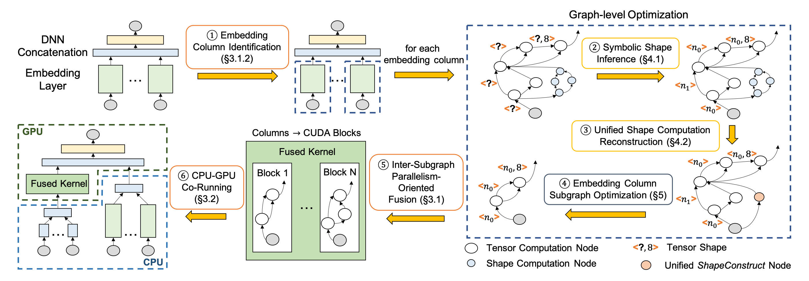

# RECom

RECom is an ML compiler that aims to accelerate the expensive embedding column processing during the inference of deep recommendation models.
Key features of RECom:

* We propose the inter-subgraph parallelism-oriented fusion method to generate efficient GPU codes to process massive embedding columns in parallel.
* We recognize the shape computation problems that arise in dynamic shape scenarios and adopt an approach based on symbolic expressions to solve them.
* We develop an embedding column optimization module to eliminate redundant computations.

Currently, RECom is implemented as a TensorFlow add-on based on [TensorFlow Addons](https://github.com/tensorflow/addons) using C++.
We also utilize the [SymEngine Library](https://github.com/symengine/symengine) to perform symbolic expression computations to handle dynamic shapes.

<p align="center">
  
  <p align="center"><b>
  The optimization workflow of RECom.
  </b></p>
</p>

## Getting Started

* [Build RECom from source](docs/build_from_source.md)
* [C++ examples](examples/cc)
* [Python examples](examples/python)
* [RECom Artifact Evaluation](AE)

## Performance

We evaluate RECom on four real-world in-house production recommendation models in Alibaba and two synthesized models.
Experimental results show that for all models under any batch size, RECom outperforms the three TensorFlow baselines significantly.
On average, RECom achieves speedups of 6.61×, 51.45×, and 8.96× for end-to-end inference latency compared with TF-CPU, TF-GPU, and TF-CPU-GPU, respectively.

<p align="center">
  
  <p align="center"><b>
  End-to-end Performance of RECom and TensorFlow baselines.
  The vertical axes are latency in the log scale.
  </b></p>
</p>

## Citation 

RECom is a collaborative research project between Alibaba Group and Renmin University of China.
You can find our ASPLOS'23 paper in this [link](https://dl.acm.org/doi/10.1145/3623278.3624761).

If you use this codebase or otherwise found our work valuable, please cite:

```bibtex
@inproceedings{pan2023recom,
  title={RECom: A Compiler Approach to Accelerating Recommendation Model Inference with Massive Embedding Columns},
  author={Pan, Zaifeng and Zheng, Zhen and Zhang, Feng and Wu, Ruofan and Liang, Hao and Wang, Dalin and Qiu, Xiafei and Bai, Junjie and Lin, Wei and Du, Xiaoyong},
  booktitle={Proceedings of the 28th ACM International Conference on Architectural Support for Programming Languages and Operating Systems, Volume 4},
  pages={268--286},
  year={2023}
}
```

