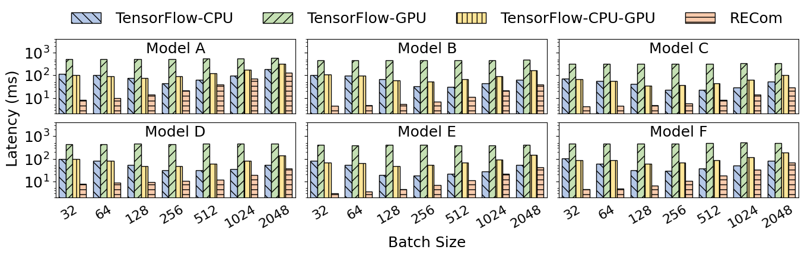

# RECom

RECom is an ML compiler that aims to accelerate the expensive embedding column processing during the inference of deep recommendation models.
Key features of RECom:

* We propose the inter-subgraph parallelism-oriented fusion method to generate efficient GPU codes to process massive embedding columns in parallel.
* We recognize the shape computation problems that arise in dynamic shape scenarios and adopt an approach based on symbolic expressions to solve them.
* We develop an embedding column optimization module to eliminate redundant computations.

Currently, RECom is implemented as a TensorFlow add-on based on [TensorFlow Addons](https://github.com/tensorflow/addons) using C++.
We also utilize the [SymEngine Library](https://github.com/symengine/symengine) to perform symbolic expression computations to handle dynamic shapes.

## Getting Started

* [Build RECom from source](docs/build_from_source.md)
* [C++ examples](examples/cc)
* [Python examples](examples/python)
* [RECom Artifact Evaluation](AE)

## Performance

We evaluate RECom on four real-world in-house production recommendation models in Alibaba and two synthesized models.
Experimental results show that for all models under any batch size, RECom outperforms the three TensorFlow baselines significantly.
On average, RECom achieves speedups of 6.61×, 51.45×, and 8.96× for end-to-end inference latency compared with TF-CPU, TF-GPU, and TF-CPU-GPU, respectively.

<figure align="center">
  
  <figcaption align = "center">
  <b>
  Figure 1: End-to-end Performance of RECom and TensorFlow baselines.
  The vertical axes are latency in the log scale.
  </b>
  </figcaption>
</figure>

## Publication

RECom is a collaborated research project between Alibaba Group and Renmin University of China.
The paper has been submitted to ASPLOS'23 Fall, accepted after major revision, and will appear together with ASPLOS'24.

Zaifeng Pan, Zhen Zheng, Feng Zhang, Ruofan Wu, Hao Liang, Dalin Wang, Xiafei Qiu, Junjie Bai, Wei Lin, Xiaoyong Du. *RECom: A Compiler Approach to Accelerating Recommendation Model Inference with Massive Embedding Columns.* (ASPLOS'23, to appear with ASPLOS'24) 
